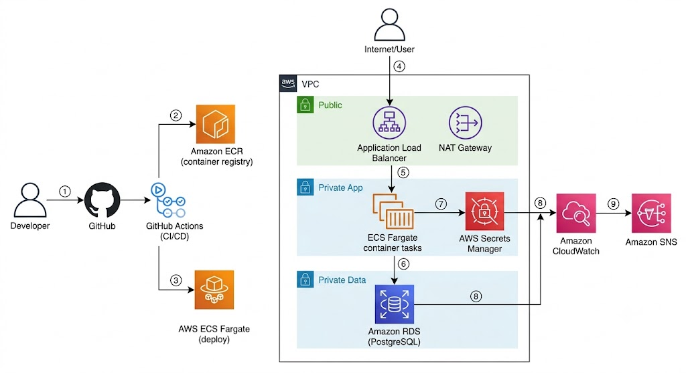
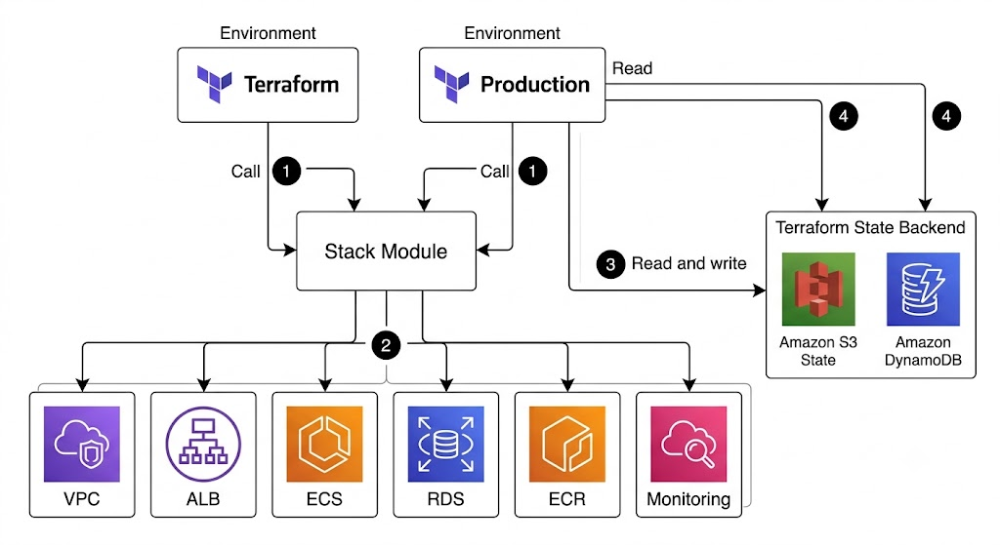

# 8Byte DevOps Assignment - Step by Step Deploy Guide

## Architecture



## Terraform Structure



Follow these in order. Every step says exactly where to click and what to type.

**Region used everywhere:** Asia Pacific (Mumbai) `ap-south-1`. Keep the same region the whole way through or resources won't find each other.

**Before you start:**
- An AWS account you can log in to
- This project pushed to a GitHub repo
- Signed in to AWS, top right region set to Asia Pacific (Mumbai)

---

## Step 1: Create the S3 Bucket for Terraform State

1. In the AWS console search bar, type `S3` and click **S3**
2. Click **Create bucket**
3. Fill in:
   - **Bucket name:** `8byte-tfstate-yourname` (must be globally unique)
   - **AWS Region:** Asia Pacific (Mumbai) ap-south-1
   - **Bucket Versioning:** Enable
   - **Block all public access:** leave ON
4. Click **Create bucket**
5. Note the bucket name down, you'll need it later

---

## Step 2: Create the DynamoDB Lock Table

1. In the search bar, type `DynamoDB` and click **DynamoDB**
2. Go to **Tables** (left sidebar), click **Create table**
3. Fill in:
   - **Table name:** `terraform-state-lock`
   - **Partition key:** `LockID`
   - **Type:** String
   - **Table settings:** Default settings
4. Click **Create table**
5. Wait until status shows **Active**

---

## Step 3: Add GitHub as an Identity Provider

1. In the search bar, type `IAM` and click **IAM**
2. Go to **Identity providers** (left sidebar), click **Add provider**
3. Fill in:
   - **Provider type:** OpenID Connect
   - **Provider URL:** `https://token.actions.githubusercontent.com`
   - **Audience:** `sts.amazonaws.com`
4. Click **Get thumbprint**
5. Click **Add provider**

---

## Step 4: Create the Deploy Role for GitHub

1. In IAM, go to **Roles** (left sidebar), click **Create role**
2. Fill in:
   - **Trusted entity type:** Web identity
   - **Identity provider:** token.actions.githubusercontent.com
   - **Audience:** sts.amazonaws.com
3. Click **Next**
4. Attach permissions (search and tick each):
   - **PowerUserAccess**
   - **IAMFullAccess**
5. Click **Next**
6. Fill in:
   - **Role name:** `8byte-github-deploy`
7. Click **Create role**
8. Open the role, go to **Trust relationships** tab, click **Edit trust policy**
9. Set the `sub` condition to your repo:
   ```json
   "Condition": {
     "StringEquals": {
       "token.actions.githubusercontent.com:aud": "sts.amazonaws.com"
     },
     "StringLike": {
       "token.actions.githubusercontent.com:sub": "repo:yourname/yourrepo:*"
     }
   }
   ```
10. Click **Update policy**
11. Copy the **Role ARN** from the top of the page, save it

---

## Step 5: Add the Secrets and Variables in GitHub

1. Open your repo on GitHub
2. Go to **Settings** > **Secrets and variables** > **Actions**
3. On the **Secrets** tab, click **New repository secret** and add the sensitive ones:
   - **AWS_OIDC_ROLE_ARN:** the role ARN from Step 4
   - **SLACK_WEBHOOK_URL:** a Slack incoming webhook (skip this if you don't use Slack)
4. On the **Variables** tab, click **New repository variable** and add the non-sensitive ones:
   - **TF_STATE_BUCKET:** the bucket name from Step 1
   - **TF_LOCK_TABLE:** the DynamoDB table name from Step 2 (`terraform-state-lock`)
   - **ALERT_EMAIL:** your email for alerts
   - **SLACK_ENABLED:** set to `true` only if you added a Slack webhook, otherwise leave it unset and the Slack notify step is skipped

---

## Step 6: Create the GitHub Environments

1. In repo **Settings**, go to **Environments** (left sidebar)
2. Click **New environment**, name it `staging`, click **Configure environment**
3. Click **New environment** again, name it `production`
4. In production, tick **Required reviewers** and add yourself
5. Click **Save protection rules**

---

## Step 7: Provision the Infrastructure

1. On your machine, create a branch and make a small change in the `terraform` folder, commit and push
2. On GitHub, open a **Pull request** into `main`
3. Go to the **Actions** tab, open the **Infra** workflow, wait for the **Plan** job to finish green
4. Merge the Pull request
5. Back in **Actions**, the **Infra** workflow runs **Apply** for staging, wait for green
6. The **production** job shows **Waiting**. Click the run > **Review deployments** > tick **production** > **Approve and deploy**
7. Wait for production apply to finish green

---

## Step 8: Confirm the Alarm Email

1. Open the inbox of your ALERT_EMAIL address
2. Open the AWS Notification email
3. Click **Confirm subscription**

---

## Step 9: Deploy the Application

1. On your machine, make a small change in the `app` folder, commit and push, open a **Pull request** into `main`
2. Go to **Actions**, watch the **CI** workflow run tests and scans, wait for green
3. Merge the Pull request
4. In **Actions**, the **CD** workflow builds the image and updates staging
5. When production shows **Waiting**, click the run > **Review deployments** > approve **production**, wait for green

---

## Step 10: Get the App URL and Test It

1. In the search bar, type `EC2` and click **EC2**
2. Go to **Load balancers** (left sidebar, under Load balancing)
3. Click `staging-alb` and copy its **DNS name**
4. Test the endpoints:
   - Browser: `http://YOUR-DNS-NAME/health` shows ok
   - Browser: `http://YOUR-DNS-NAME/metrics` shows app metrics
   - Terminal:
     ```
     curl -X POST http://YOUR-DNS-NAME/visits -H "Content-Type: application/json" -d "{\"note\":\"hello\"}"
     curl http://YOUR-DNS-NAME/visits
     ```

---

## Step 11: Look at the Dashboards

1. In the search bar, type `CloudWatch` and click **CloudWatch**
2. Go to **Dashboards** (left sidebar)
3. Open `staging-app-infra` for ECS CPU/memory, requests, 5xx, latency
4. Open `staging-database` for RDS CPU, connections, storage, memory

---

## Step 12: Check the Secret and Rotation

1. In the search bar, type `Secrets Manager` and click it
2. Click the secret `staging-db-credentials`
3. Under **Rotation**, confirm it is enabled with a 1 day schedule
4. Click **Retrieve secret value** to see the username, password, host and dbname

---

## Step 13: Tear It Down When Finished

1. Run destroy for each environment from your machine:
   ```
   cd terraform/environments/production
   terraform init -backend-config="bucket=YOUR_STATE_BUCKET"
   terraform destroy -var="container_image=placeholder" -var="alert_email=you@example.com"

   cd ../staging
   terraform init -backend-config="bucket=YOUR_STATE_BUCKET"
   terraform destroy -var="container_image=placeholder" -var="alert_email=you@example.com"
   ```
2. Then delete the manual pieces:
   - The S3 state bucket (empty it first)
   - The DynamoDB table `terraform-state-lock`
   - In IAM, the role `8byte-github-deploy` and the identity provider

---

## Optional: Run Terraform From Your Own Machine

```
cd terraform/environments/staging
terraform init -backend-config="bucket=YOUR_STATE_BUCKET"
terraform plan -var="container_image=ECR_IMAGE_URI" -var="alert_email=you@example.com"
terraform apply -var="container_image=ECR_IMAGE_URI" -var="alert_email=you@example.com"
```

Production is the same, just from the production folder.

---

## CI checks and code quality

Every pull request runs the CI workflow, which does:

- **Lint** the app with ESLint
- **Unit + integration tests** against a real Postgres, with coverage
- **Dependency scan** with npm audit (fails on high/critical)
- **Container image scan** with Trivy
- **IaC security scan** of the Terraform with tfsec and Trivy config
- **CodeQL** code scanning (GitHub native, results show in the Security tab)

Caching:
- npm dependencies are cached by the setup-node action
- Docker layers are cached (GitHub Actions cache in CI, and pushed to the ECR
  repo as a `buildcache` tag in CD) so image builds are faster

### GitHub Security and quality

This uses GitHub's built-in security features, so there's nothing external to
sign up for:

- **CodeQL** runs as a job in the CI workflow on every pull request and reports
  findings under the repo's Security tab, Code scanning alerts.
- **Dependabot** (`.github/dependabot.yml`) watches the npm and GitHub Actions
  dependencies and opens PRs to bump vulnerable versions. Turn on Dependabot
  alerts under Settings, Code security.
- **Secret scanning** is enabled from Settings, Code security.
- A **security policy** lives in `SECURITY.md`.

### Pre-commit hooks (local)

The repo has a `.pre-commit-config.yaml` that runs terraform fmt/validate,
whitespace fixes, a private-key check, and gitleaks before each commit.

```
pip install pre-commit
pre-commit install
pre-commit run --all-files
```
